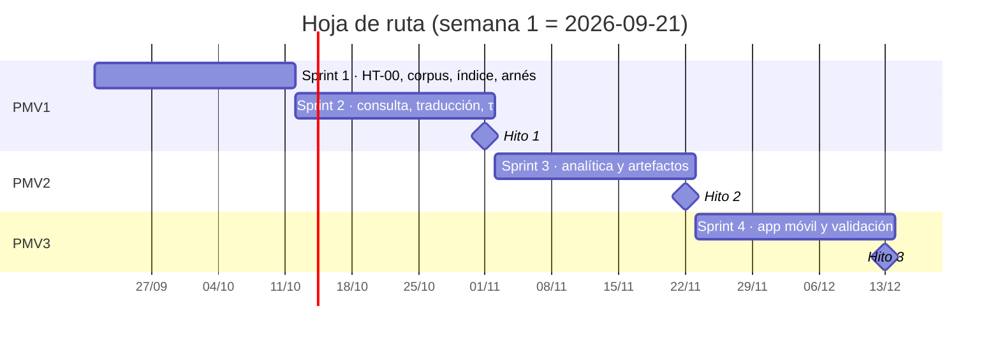
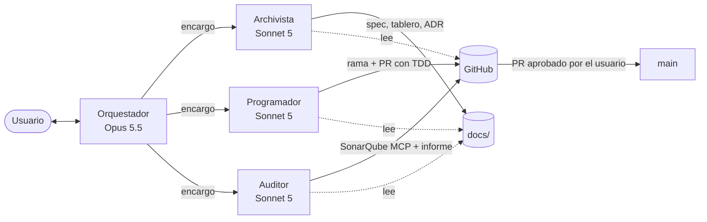

# 00 · Índice maestro y plan del proyecto

**Asistente conversacional basado en un modelo de lenguaje pequeño con recuperación aumentada para la
preservación y consulta digital del quechua wanka de Junín**

Taller de Proyectos 1 · Universidad Continental · Ingeniería de Sistemas e Informática · 2026-20 · Grupo 02

> **Punto de entrada para personas y agentes.** Todo agente lee este archivo antes de actuar y sigue el
> orden de lectura del §3. Mantenido por: **archivista** · Última revisión: 2026-10-01 · Versión 1.4

---

## 1. Propósito de esta carpeta

`SDD_RAG_Quechua/docs` es la **especificación viva** del software. La serie documental (Documentos 0 a 6,
en `docs_idea2/`) justificó el proyecto ante el curso; esta carpeta traduce esa serie a lo que un equipo
de desarrollo —humano y de agentes— necesita para construir los tres PMV sin volver a leer 200 páginas:
qué construir, cómo comprobarlo, en qué orden y quién hace cada cosa.

---

## 2. Estado actual del proyecto

| Campo | Valor |
|---|---|
| Fase | **Cierre del PMV1** para la entrega de la Unidad II (semana del 2026-09-28; CHG-16) — `PROMPT_CIERRE_PMV1.md` |
| Línea base | Revisión 2 de los Documentos 0–6 (`09_LINEA_BASE_V2.md`), adoptada el 2026-09-24 |
| Repositorio | Creado con `crear_repo.ps1` (`10_REPOSITORIO.md`); etiqueta `base-integrante` |
| Línea base del arnés | Congelada el 2026-10-01: `docs/evidencias/2026-10-01_base-integrante_pc-rtx4060/` (40/40 pruebas; 0 FP en C con τ 0,48; cifras citan solo `fragmentos_v3`) |
| Brechas frente a la rúbrica | `13_BRECHAS_RUBRICA.md` adoptado el 2026-10-01; su lista P0 (§7) sustituye a la del prompt §5 |
| Decisiones pendientes del usuario | ADR-027 (SQLite) y ADR-013 (texto de la consulta): sin preferencia expresada, antes del PR 8 · historial de Git divergente local/remoto (`13` §1.1) · lista de fallos de la interfaz · nombres y roles · fecha exacta de la exposición · licencias del manifiesto · `.github/projects/crear_projects.ps1` · medir M16 · `SONARQUBE_ORG` y token de Cloud · aprobar las specs PR-01 y PR-02 |
| Bloqueos | Ninguno (PR-08 depende de ADR-027 y ADR-013) |
| Última decisión registrada | 2026-10-01: ADR-021 aceptada (5 condiciones); τ 0,48 confirmado (ADR-020, nota); defecto D-6 |

---

## 3. Mapa de documentos y orden de lectura

| Orden | Archivo | Qué contiene | Quién lo usa sobre todo |
|---|---|---|---|
| 1 | `00_INDICE_MAESTRO.md` | Este índice, estado y plan maestro | Todos |
| 2 | `01_CONTEXTO_GENERAL.md` | El proyecto destilado de los siete documentos: problema, alcance, arquitectura, stack, parámetros medidos, riesgos, normativa, glosario | Todos, al empezar |
| 3 | `02_REQUERIMIENTOS.md` | RF, RNF, reglas de negocio (RN), datos (RD), seguridad (RS), restricciones y trazabilidad | Orquestador, programador, auditor |
| 4 | `03_HISTORIAS_USUARIO.md` | Historias INVEST con criterios Gherkin, DoR y DoD | Programador (pruebas), archivista (specs) |
| 5 | `04_SPRINTS.md` | Calendario, compromiso, criterios de hito y resultados por sprint | Orquestador, archivista |
| 6 | `05_KANBAN.md` | Tablero vivo con límites de trabajo en curso | Todos |
| 7 | `06_MODELO_AGENTES.md` | Roles, ciclo SDD, delegación, TDD, auditoría, Git, SonarQube | Orquestador y cada subagente |
| 8 | `07_DECISIONES.md` | Registro de decisiones (ADR) | Todos antes de cambiar algo estructural |
| 9 | `08_AUDITORIA_REPO_BASE.md` | Auditoría del código base y brechas frente a la línea base v2 | Orquestador, auditor |
| 10 | `09_LINEA_BASE_V2.md` | **Decisiones vigentes** (manda sobre 01…07 donde difieran) | Todos |
| 11 | `10_REPOSITORIO.md` | Cómo se creó el repositorio | Usuario, orquestador |
| 12 | `11_CASOS_VIDEO_Y_CAPTURAS.md` | Casos de prueba a mano, defectos D-1…D-6, guion del video, capturas E1 | Usuario, QA, frontend |
| 13 | `12_MEDICIONES_PARA_DIAPOSITIVAS.md` | Medición → diapositiva/figura; qué entregar | QA, orquestador |
| 14 | `13_BRECHAS_RUBRICA.md` | Brechas frente a la rúbrica, cifras de la línea base (v3), condiciones de ADR-021, D-6, M16 y M17, lista P0 vigente (§7) | Orquestador, archivista, equipo |
| — | `specs/_PLANTILLA_SPEC.md` | Plantilla de especificación por historia | Archivista |
| — | `specs/<ID>/spec.md` | Especificación aprobada de cada historia | Programador |
| — | `auditorias/<PR>.md` | Informes del auditor | Orquestador, usuario |
| — | `../CLAUDE.md` | Reglas, método y estado para Claude Code | Orquestador (se carga en cada sesión) |
| — | `../.claude/agents/*.md` | Definición de archivista, programador y auditor | Claude Code |
| — | `../corpus/` | PDF (fuera de Git) y `MANIFIESTO.yaml` | Programador, archivista |
| — | `../referencia_poc/` | Scripts, datos y resultados de la prueba de concepto | Programador, auditor |

**Lectura mínima por rol al iniciar una tarea:**

| Rol | Lee siempre | Y además |
|---|---|---|
| Orquestador | 00, 05, 07 | Lo que exija la decisión en curso |
| Archivista | 00, 05, 04 | El archivo que va a modificar |
| Programador | `CLAUDE.md`, 00 §5, la spec de la historia | 02 §4 (reglas de negocio) y los escenarios Gherkin |
| Auditor | 02 §4 y §6, 06 §6 | La spec y el diff del PR |

---

## 4. Plan maestro

### 4.1 Objetivo y resultado esperado por PMV

| PMV | Semanas | Pregunta de validación | Entregable | Criterio de éxito principal |
|---|---|---|---|---|
| PMV1 | S1–S6 | ¿Funciona la consulta con trazabilidad y abstención sobre el corpus real? | Aplicación web (React) sobre servicio de escritorio (FastAPI) | recall@5 ≥ 0,80 en A, B y D · **0 FP en C** · 100 % de respuestas con documento y página · P95 ≤ 8 s |
| PMV2 | S7–S9 | ¿Aporta valor la analítica y los artefactos móviles son equivalentes al escritorio? | Modelos predictivos (pendientes) + índice exportado (hecho) | Paridad aritmética comprobada · predictores que no aumentan los FP |
| PMV3 | S10–S12 | ¿Opera de forma autónoma en un dispositivo de gama media? | APK sin conexión, sin modelo (compositor determinista, ADR-026) | Modo avión · ≤ 15 s · recuperación ≤ 100 ms · paquete ≤ 1,2 GB · 0 FP en C en el dispositivo |

### 4.2 Hoja de ruta

### 4.3 Hitos y decisión de paso

| Hito | Fecha | Decide | Si no se cumple |
|---|---|---|---|
| Hito 1 | 2026-11-01 | Si se inicia el PMV2 | Activar la respuesta a R-01 o reformular el alcance antes del sprint 3 |
| Hito 2 | 2026-11-22 | Si se inicia la integración móvil | El sprint 4 se reorienta a resolver la divergencia entre plataformas |
| Hito 3 | 2026-12-13 | Qué se declara alcanzado y qué queda como trabajo futuro | Se declaran los mínimos **verificados** del dispositivo |

### 4.4 Flujo de trabajo (resumen de `06_MODELO_AGENTES.md`)

Por historia: **especificar ◆ planificar → desglosar → implementar con TDD ◆ auditar ◆ corregir →
revisar y fusionar ◆ → archivar.** Las compuertas ◆ son: spec aprobada por el usuario, CI en verde,
auditoría sin bloqueantes y aprobación humana del PR.

### 4.5 Riesgos principales del desarrollo

| Riesgo | Probabilidad | Impacto | Respuesta |
|---|---|---|---|
| La recalibración de τ tras la traducción deja D por debajo de 0,80 | Media | Alto | Probar la glosa en inglés (reserva de ADR-008); declarar incumplimiento parcial documentado |
| No se obtienen consultas de docentes de EIB (HT-02) | Alta | Medio | Cursar la solicitud en la semana 1; declarar la limitación en el Hito 1 |
| Deriva de contexto entre sesiones de agentes | Media | Medio | Archivista al cierre de cada sesión; `CLAUDE.md` con estado actual |
| El paquete móvil supera 1,2 GB | Media | Alto | Sustitución prevista (Gemma 3 1B + MediaPipe) con recalibración de τ |
| Recuperación densa en el móvil degrada la salvaguarda | Alta si se mantiene E5 | Alto | Decidir ADR-012 con datos antes del sprint 3 |
| Registro de consultas insuficiente para HU-09 | Alta | Bajo | Comportamiento del escenario «historial insuficiente»; nunca fabricar datos |
| Código generado con defectos sutiles | Media | Medio | TDD + auditor + SonarQube + revisión humana |

### 4.6 Supuestos

1. La semana 1 es la del **lunes 2026-09-21** (confirmado por el usuario el 2026-09-24); HT-00 consume parte del sprint 1.
2. El equipo de desarrollo tiene acceso a la PC de referencia (RTX 4060, 8 GB VRAM) y a un teléfono
   Android ARM64 de gama media para el sprint 4.
3. Los artefactos de `docs_idea2/poc/` (ingesta, fragmentos, conjunto de evaluación, experimento) están
   disponibles y se promueven a código, no se rehacen.
4. El corpus permanece en ocho documentos al inicio del sprint 1 (`corpus/pdf/`); los nuevos se añaden con su entrada en `corpus/MANIFIESTO.yaml`.

### 4.7 Próximos pasos inmediatos (semana 1)

1. **Usuario:** revisar `CLAUDE.md`, `.claude/agents/`, `.mcp.json` y esta carpeta.
2. **Usuario:** completar licencias y fuentes «por registrar» en `corpus/MANIFIESTO.yaml`.
3. **Usuario:** crear el repositorio privado en GitHub, los tokens de SonarQube (Cloud y local) y las
   variables de entorno; abrir Claude Code en `SDD_RAG_Quechua/`.
4. **Orquestador → programador:** HT-00 (esqueleto hexagonal con `uv`, prueba de arquitectura, CI con
   SonarQube Cloud y cobertura).
5. **Todos:** PR de prueba de extremo a extremo.
6. **Usuario:** cursar la solicitud de consultas a docentes de EIB (HT-02).

---

## 5. Reglas que todo agente aplica sin excepción

1. Ninguna forma quechua se redacta, completa o corrige: todas salen literales del fragmento, con fuente.
2. Ninguna respuesta sin documento y página.
3. τ se fija por ausencia de falsos positivos, vive en configuración y se recalibra con el arnés.
4. Las particiones de evaluación se reportan por separado.
5. Nunca inventar cifras: lo no medido es «por registrar».
6. Un resultado negativo se reporta igual que uno positivo.
7. DoD-4 se verifica en todos los incrementos.
8. Nada se fusiona en `main` sin aprobación humana.

---

## 6. Registro de versiones de la documentación

| Fecha | Versión | Cambio | Autor |
|---|---|---|---|
| 2026-09-24 | 1.0 | Creación de la carpeta SDD a partir de los Documentos 0–6 y del cuaderno integral | Orquestador |
| 2026-09-24 | 1.1 | Calendario confirmado (semana 1 = 2026-09-21); CLAUDE.md, subagentes, MCP, corpus y referencia de la PoC | Orquestador |
| 2026-09-24 | 1.2 | Línea base v2 (revisión 2): `09`, ADR-019 a 027, CONSIDERACIONES v3 | Asistente documental |
| 2026-10-01 | 1.3 | `10` (repositorio y `crear_repo.ps1`), `11` (casos, video, defectos D-1…D-5), `12` (mediciones para diapositivas), `PROMPT_CIERRE_PMV1.md`; subagentes a v2 | Asistente documental |
| 2026-10-01 | 1.4 | `13_BRECHAS_RUBRICA.md` incorporado al mapa; estado del §2 al día (línea base congelada, ADR-021 aceptada, D-6); specs PR-01 y PR-02 en borrador | Archivista |
